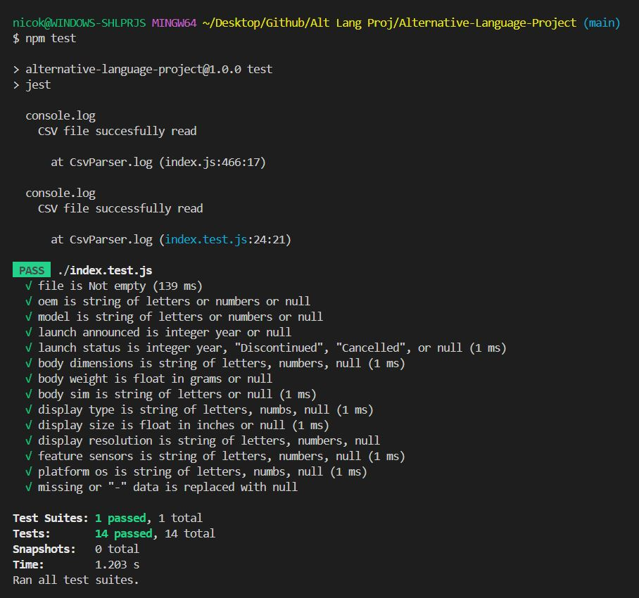
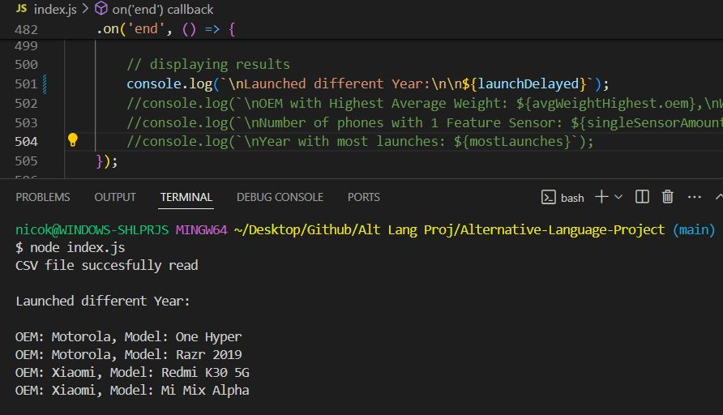

# Alternative-Language-Project *Data Cleaning*

Submitted by: **Nicolas Kraft**

### Installation guide for Replit:

**Installation:**  
**The package.json file lists my libraries under dependencies section (csv-parser), and can be installed with 'npm install' in terminal. The fs module (to read in files) is a core Node.js module and doesn't need to be installed separately.**  

This project requires Node.js and npm. After cloning the project, navigate to the project directory and run the following command to install the necessary libraries:

```bash
npm install
```

**Running the Project:**  
Run the `index.js` file. In Replit, this can be done by clicking the "Run" button, or using the command to run it in terminal:  

```bash
node index.js
```

**Running the Unit Tests:** 
Since I used a common testing framework called 'Jest' (in package.json under scripts: test: jest), it can be run in terminal with following command:  

```bash
npm test
```




### This project:

**This project is a data analysis tool for a dataset of 1,000 mobile phones. It reads in data from a CSV file, which includes various details about each phone such as the OEM, model, launch date, body dimensions, display type etc.**

**The data is cleaned and processed into a more manageable format, with each phone represented as an instance of a Phone class. This class includes getter and setter methods for each property.**

**The project includes several methods for performing statistical analysis on the data. These methods can answer questions like "Which company has the highest average weight of phone body?" or "What year had the most phones launched?" etc.**

**The project also includes some basic unit tests to ensure the accuracy and reliability of these methods. Error handling is implemented throughout the project to manage potential issues with the data or the file system, ensuring the program can run smoothly and provide accurate results.**

## Report

Which programming language and version did I pick?:

**JavaScript Node.js v20.11.0**

Why did I pick this programming language?:

**I chose JS because I just started learning React.js this semester, and wanted to try to use JS in a different context than web app design. I was debating between Java and JavaScript, but went with JS**

How my programming language chosen handles: object-oriented programming, file ingestion, conditional statements, assignment statements, loops, subprograms (functions/methods), unit testing and exception handling. If one or more of these are not supported by your programming language, indicate it as so:

**OOP - JS supports OOP with classes (and prototypes). So I was able to create a class with constructors, methods (and potentially inheritance)**

**File Ingestion: Node.js does have a built in module called 'fs' for File System (which I used), that allowed me to interact with the file system on my computer. SO through that I can read, write, update, or delete files.**

**Conditional Statements: JS definitely supports conditional statements such as if else, switch, and ternary operators for decision. I believe I mainly used if else and ternary.**

**Assignment Statements: JS uses the = operator for assignment. It also supports compound assignment operators like +=, -=, /=, etc.**

**Loops: JS supports several types of loops including for, while, and do...while, as well as array methods like forEach, map, filter, reduce, etc. I did use the latter ones a lot.**

**Subprograms (Functions/Methods): JS supports functions, including arrow functions, and methods (functions associated with an object or class). Functions can be named or anonymous and can be defined using function declarations or function expressions.**

**Unit Testing: JS supports unit testing with various libraries and frameworks such as Jest, Mocha, Jasmine, etc. These allow you to write test suites with multiple test cases, mock functions, and check assertions. I used Jest.**

**Exception Handling: JS supports exception handling with try, catch, finally blocks. So I was able to throw exceptions using the throw statement and create custom error types by extending the Error class.**

List out 3 libraries I used from my programming language (if applicable) and explain what they are, why I chose them and what I used them for:

**I used 2 libraries / modules:**

**fs: This is a built in Node.js module that provides an API for interacting with the file system. I've used it to read and write files. It's a reliable and widely-used module (I think), which is why I chose it.**

**csv-parser: This is a third-party library that provides tools for parsing CSV data. I've used it because I had to read data from a CSV file and convert it into a format that's easier to work with in JavaScript. I chose it because it's simple to use and does exactly what you need.**

## Answering 4 Questions:
### Q1
What company (oem) has the highest average weight of the phone body?

**Company with highest average weight: HP**

**weight: 453.6**


### Q2
Were there any phones that were announced in one year and released in another? What are they? Give me the oem and models:


**Launched different Year:**

OEM: Motorola, Model: One Hyper
OEM: Motorola, Model: Razr 2019
OEM: Xiaomi, Model: Redmi K30 5G
OEM: Xiaomi, Model: Mi Mix Alpha  





### Q3
How many phones have only one feature sensor?:

**Number of phones with 1 Feature Sensor: 432**


### Q4
What year had the most phones launched in any year later than 1999?:

**Year with most launches: 2019**

