# Alternative-Language-Project *Data Cleaning*

Submitted by: **Nicolas Kraft**

This project: 

**This project is a data analysis tool for a dataset of 1,000 mobile phones. It reads in data from a CSV file, which includes various details about each phone such as the OEM, model, launch date, body dimensions, display type etc.**

**The data is cleaned and processed into a more manageable format, with each phone represented as an instance of a Phone class. This class includes getter and setter methods for each property.**

**The project includes several methods for performing statistical analysis on the data. These methods can answer questions like "Which company has the highest average weight of phone body?" or "What year had the most phones launched?" etc.**

**The project also includes some basic unit tests to ensure the accuracy and reliability of these methods. Error handling is implemented throughout the project to manage potential issues with the data or the file system, ensuring the program can run smoothly and provide accurate results.**

Which programming language and version did I pick?: 

**JavaScript Node.js v20.11.0**

Why did I pick this programming language?: 

**I chose JS because I just started learning React.js this semester, and wanted to try to use JS in a different context than web app design. I was debating between Java and JavaScript, but went with JS**

How my programming language chosen handles: object-oriented programming, file ingestion, conditional statements, assignment statements, loops, subprograms (functions/methods), unit testing and exception handling. If one or more of these are not supported by your programming language, indicate it as so:

**OOP - JS supports OOP with classes (and prototypes). So I was able to create a class with constructors, methods (and potentially inheritance)**

**File Ingestion: Node.js does have a built in module called 'fs' for File System (which I used), that allowed me to interact with the file system on my computer. SO through that I can read, write, update, or delete files.**

**Conditional Statements: JS definitely supports conditional statements such as if else, switch, and ternary operators for decision. I believe I mainly used if else and ternary.**

**Assignment Statements: JS uses the = operator for assignment. It also supports compound assignment operators like +=, -=, /=, etc.**

**Loops: JS supports several types of loops including for, while, and do...while, as well as array methods like forEach, map, filter, reduce, etc. I did use the latter ones a lot.**

**Subprograms (Functions/Methods): JS supports functions, including arrow functions, and methods (functions associated with an object or class). Functions can be named or anonymous and can be defined using function declarations or function expressions.**

**Unit Testing: JS supports unit testing with various libraries and frameworks such as Jest, Mocha, Jasmine, etc. These allow you to write test suites with multiple test cases, mock functions, and check assertions. I used Jest.**

**Exception Handling: JS supports exception handling with try, catch, finally blocks. So I was able to throw exceptions using the throw statement and create custom error types by extending the Error class.**

List out 3 libraries I used from my programming language (if applicable) and explain what they are, why I chose them and what I used them for:

**I used 2 libraries / modules:**

**fs: This is a built in Node.js module that provides an API for interacting with the file system. I've used it to read and write files. It's a reliable and widely-used module (I think), which is why I chose it.**

**csv-parser: This is a third-party library that provides tools for parsing CSV data. I've used it because I had to read data from a CSV file and convert it into a format that's easier to work with in JavaScript. I chose it because it's simple to use and does exactly what you need.**

## Answering 4 Questions:
### Q1
What company (oem) has the highest average weight of the phone body?

**Company with highest average weight: HP**

**weight: 453.6**

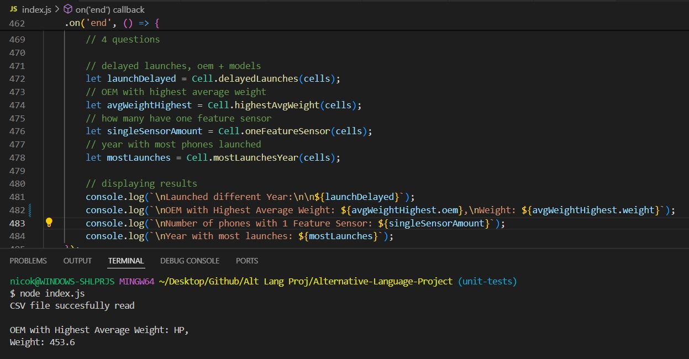

### Q2
Were there any phones that were announced in one year and released in another? What are they? Give me the oem and models:

**Launched different Year:**

OEM: Benefon, Model: Vega

OEM: Garmin Asus, Model: nuvifone M10

OEM: Gigabyte, Model: GSmart G1305 Boston

OEM: Gigabyte, Model: GSmart

OEM: Haier, Model: N60

OEM: Haier, Model: T3000

OEM: Haier, Model: V280

OEM: Haier, Model: V190

OEM: Haier, Model: V100

OEM: Haier, Model: P5

OEM: Haier, Model: Z8000

OEM: HP, Model: Slate8 Pro

OEM: HTC, Model: Schubert

OEM: Huawei, Model: Ascend Plus

OEM: Huawei, Model: MediaPad 7 Youth

OEM: Huawei, Model: G7002

OEM: i mate, Model: PDA2

OEM: i mate, Model: Smartphone2

OEM: i mate, Model: Smartphone

OEM: i mobile, Model: 510

OEM: i mobile, Model: 315

OEM: Icemobile, Model: Gravity 4.0

OEM: Icemobile, Model: Prime 5.5

OEM: Icemobile, Model: Prime 4.5

OEM: Icemobile, Model: Gravity Pro

OEM: Icemobile, Model: Quattro

OEM: Innostream, Model: INNO A20

OEM: Innostream, Model: INNO 75

OEM: Innostream, Model: INNO 79

OEM: Innostream, Model: INNO 78

OEM: Innostream, Model: INNO 30

OEM: Innostream, Model: INNO 55

OEM: Innostream, Model: INNO 70

OEM: Innostream, Model: INNO 99

OEM: Innostream, Model: INNO 120

OEM: Innostream, Model: INNO 110

OEM: Innostream, Model: INNO 100

OEM: Kyocera, Model: TG 200

OEM: LG, Model: L20

OEM: LG, Model: KM338

OEM: LG, Model: U890

OEM: LG, Model: P7200

OEM: LG, Model: B2050

OEM: LG, Model: M4410

OEM: LG, Model: M4330

OEM: LG, Model: M4300

OEM: LG, Model: F3000

OEM: LG, Model: F2410

OEM: LG, Model: F2250

OEM: LG, Model: U8290

OEM: LG, Model: U8210

OEM: LG, Model: U8200

OEM: LG, Model: B2150

OEM: LG, Model: B2100

OEM: LG, Model: B2000

OEM: LG, Model: F2400

OEM: LG, Model: F1200

OEM: LG, Model: F7250

OEM: LG, Model: C2100

OEM: LG, Model: G1800

OEM: LG, Model: G1610

OEM: LG, Model: G1700

OEM: LG, Model: F2300

OEM: LG, Model: F2100

OEM: LG, Model: L3100

OEM: LG, Model: C1200

OEM: LG, Model: G1600

OEM: LG, Model: G7200

OEM: LG, Model: U8150

OEM: LG, Model: G7070

OEM: LG, Model: G7050

OEM: LG, Model: G1500

OEM: LG, Model: G5310

OEM: LG, Model: W7020

OEM: LG, Model: W5200

OEM: LG, Model: LG 600

OEM: LG, Model: LG 500

OEM: LG, Model: LG 200

OEM: Maxon, Model: MX C90

OEM: Maxon, Model: MX C80

OEM: Maxon, Model: MX C180

OEM: Maxon, Model: MX A30

OEM: Maxon, Model: MX C60

OEM: Maxon, Model: MX C20

OEM: Maxon, Model: MX C110

OEM: Maxon, Model: MX E10

OEM: Maxon, Model: MX V10

OEM: Maxon, Model: MX V30

OEM: Maxon, Model: MX 7990

OEM: Maxon, Model: MX E80

OEM: Maxon, Model: MX 7750

OEM: Maxon, Model: MX C11

OEM: Maxon, Model: MX C160

OEM: Maxon, Model: MX 7940

OEM: Maxon, Model: MX 7920

OEM: Maxon, Model: MX 7830

OEM: Maxon, Model: MX 7600

OEM: Maxon, Model: MX 6879

OEM: Maxon, Model: MX 6869

OEM: Maxon, Model: MX 6815

OEM: Maxon, Model: MX 6814

OEM: Micromax, Model: A36 Bolt

OEM: Micromax, Model: A28 Bolt

OEM: Micromax, Model: Bolt A62

OEM: Micromax, Model: Bolt A35

OEM: Micromax, Model: Bolt A27

OEM: Micromax, Model: GC275

OEM: Mitac, Model: MIO Leap G50

OEM: Mitac, Model: MIO Leap K1

OEM: Mitac, Model: MIO A701

OEM: Mitac, Model: MIO 8870

OEM: Mitac, Model: MIO 8860

OEM: Mitsubishi, Model: M750

OEM: Mitsubishi, Model: M342i

OEM: Mitsubishi, Model: M341i/M720

OEM: Mitsubishi, Model: Trium Eclipse

OEM: Mitsubishi, Model: Trium Sirius

OEM: Mitsubishi, Model: Trium Mondo

OEM: Motorola, Model: XOOM MZ604

OEM: Motorola, Model: XOOM MZ601

OEM: Motorola, Model: QUENCH

OEM: Motorola, Model: XT701

OEM: Motorola, Model: A910

OEM: Motorola, Model: E895

OEM: Motorola, Model: E1060

OEM: Motorola, Model: C168

OEM: Motorola, Model: E680i

OEM: Motorola, Model: V560

OEM: Motorola, Model: V186

OEM: Motorola, Model: V176

OEM: Motorola, Model: C980

OEM: Motorola, Model: A780

OEM: Motorola, Model: C975

OEM: Motorola, Model: V555

OEM: Motorola, Model: A840

OEM: Motorola, Model: E398

OEM: Motorola, Model: MPx

OEM: Motorola, Model: MPx100

OEM: Motorola, Model: V872

OEM: Motorola, Model: V878

OEM: Motorola, Model: A925

OEM: Motorola, Model: A920

OEM: Motorola, Model: V690

OEM: Motorola, Model: A835

OEM: Motorola, Model: T725

OEM: Motorola, Model: T720i

OEM: Motorola, Model: T720

OEM: Motorola, Model: V70

OEM: Motorola, Model: C336

OEM: Motorola, Model: C332

OEM: Motorola, Model: C331

OEM: Motorola, Model: V60i

OEM: Motorola, Model: Accompli 388

OEM: Motorola, Model: V60

OEM: Motorola, Model: Accompli 008

OEM: Motorola, Model: Timeport 280

OEM: Motorola, Model: V.box(V100)

OEM: Motorola, Model: StarTAC 130

OEM: Motorola, Model: StarTAC 85

OEM: Motorola, Model: StarTAC Rainbow

OEM: Motorola, Model: StarTAC 75+

OEM: Motorola, Model: StarTAC 75

OEM: Motorola, Model: SlimLite

OEM: Motorola, Model: cd930

OEM: Motorola, Model: cd920

OEM: Motorola, Model: M3188

OEM: Motorola, Model: M3288

OEM: Motorola, Model: M3588

OEM: Motorola, Model: M3688

OEM: Motorola, Model: M3788

OEM: Motorola, Model: M3888

OEM: Motorola, Model: Moto Z4 Force

OEM: Motorola, Model: Moto Z4 Play

OEM: Motorola, Model: P40

OEM: NEC, Model: N401i

OEM: NEC, Model: N343i

OEM: NEC, Model: N200

OEM: NEC, Model: N923

OEM: NEC, Model: N920

OEM: NEC, Model: e338

OEM: NEC, Model: e228

OEM: NEC, Model: N410i

OEM: NEC, Model: N400i

OEM: NEC, Model: N331i

OEM: NEC, Model: N830

OEM: NEC, Model: N820

OEM: NEC, Model: e606

OEM: NEC, Model: e232

OEM: NEC, Model: DB4100

OEM: NEC, Model: G9D+

OEM: Neonode, Model: N1m

OEM: Nokia, Model: X6 8GB (2010)

OEM: Nokia, Model: X6 16GB (2010)

OEM: Nokia, Model: X6 (2009)

OEM: Nokia, Model: 6131 NFC

OEM: Nokia, Model: 8.1 Plus

OEM: O2, Model: Cosmo

OEM: O2, Model: XDA Orion

OEM: O2, Model: X1b

OEM: O2, Model: XM

OEM: O2, Model: X4

OEM: O2, Model: XDA IIs

OEM: O2, Model: XDA IIi

OEM: O2, Model: Xphone II

OEM: O2, Model: XDA II

OEM: O2, Model: Xphone

OEM: O2, Model: XDA

OEM: Oppo, Model: A31 (2015)

OEM: Orange, Model: Gova

OEM: Palm, Model: Treo 650

OEM: Panasonic, Model: Eluga DL1

OEM: Panasonic, Model: VS7

OEM: Panasonic, Model: MX7

OEM: Panasonic, Model: SA7

OEM: Panasonic, Model: X70

OEM: Panasonic, Model: GD87

OEM: Panasonic, Model: GD67

OEM: Panasonic, Model: GD75

OEM: Panasonic, Model: GD35

OEM: Panasonic, Model: GD93

OEM: Panasonic, Model: GD30

OEM: Pantech, Model: Crux

OEM: Pantech, Model: Laser P9050

OEM: Pantech, Model: GF100

OEM: Pantech, Model: GF200

OEM: Pantech, Model: GB100

OEM: Philips, Model: W5510

OEM: Philips, Model: W6350

OEM: Philips, Model: W930

OEM: Philips, Model: 362

OEM: Philips, Model: 868

OEM: Philips, Model: 859

OEM: Philips, Model: Fisio 625

OEM: Philips, Model: Fisio 620

OEM: Philips, Model: Fisio 610

OEM: Philips, Model: Azalis 268

OEM: Philips, Model: Azalis 238

OEM: Philips, Model: Diga

OEM: Philips, Model: Fizz

OEM: Qtek, Model: 8600

OEM: Qtek, Model: 8300

OEM: Qtek, Model: 8080

OEM: Qtek, Model: 8060

OEM: Qtek, Model: 1010

OEM: Qtek, Model: 7070

OEM: Realme, Model: XT 730G

OEM: Sagem, Model: my411C Oxbow

OEM: Sagem, Model: my230x

OEM: Sagem, Model: my900C

OEM: Sagem, Model: my500X

OEM: Sagem, Model: my400V

OEM: Sagem, Model: my301X

OEM: Sagem, Model: my200x

OEM: Sagem, Model: my100X

OEM: Sagem, Model: MY C2 3

OEM: Sagem, Model: myZ 5

OEM: Sagem, Model: MY C3 2

OEM: Sagem, Model: MY Z 55

OEM: Sagem, Model: MY X6 2

OEM: Sagem, Model: MY X2 2

OEM: Sagem, Model: MY C5 2

OEM: Sagem, Model: MY X1 2

OEM: Sagem, Model: MY X 8

OEM: Sagem, Model: MY X 4

OEM: Sagem, Model: MY S 7

OEM: Sagem, Model: MY Z 3

OEM: Sagem, Model: MY C2 2

OEM: Sagem, Model: SG 321i

OEM: Sagem, Model: MY V 55

OEM: Sagem, Model: MY X5 2

OEM: Sagem, Model: MY V 75

OEM: Sagem, Model: MY X 7

OEM: Sagem, Model: MY V 65

OEM: Sagem, Model: MY C 1

OEM: Sagem, Model: MY X 1w

OEM: Sagem, Model: MY C 2

OEM: Sagem, Model: MY C 6

OEM: Sagem, Model: MY C 5w

OEM: Sagem, Model: MY X 2

OEM: Sagem, Model: MY X 6

OEM: Sagem, Model: MY G5

OEM: Sagem, Model: MY X 3

OEM: Sagem, Model: MY X 5

OEM: Sagem, Model: MY 3078

OEM: Sagem, Model: MW 3026

OEM: Sagem, Model: MW 3052

OEM: Sagem, Model: MW 3042

OEM: Sagem, Model: MW 3040

OEM: Sagem, Model: MW X1

OEM: Sagem, Model: WA 3050

OEM: Sagem, Model: MW 3020

OEM: Sagem, Model: MC 3000

OEM: Sagem, Model: MC 939 WAP

OEM: Sagem, Model: MC 936

OEM: Sagem, Model: MC 950

OEM: Sagem, Model: MC 959

OEM: Sagem, Model: MC 940

OEM: Sagem, Model: MC 932

OEM: Sagem, Model: RC 922

OEM: Sagem, Model: MC 912

OEM: Sagem, Model: MC 850

OEM: Sagem, Model: MC 825 FM

OEM: Sagem, Model: MC 820

OEM: Sagem, Model: RC 750

OEM: Sagem, Model: RC 730

OEM: Samsung, Model: E1260B

OEM: Samsung, Model: Continuum I400

OEM: Samsung, Model: Focus

OEM: Samsung, Model: P940

OEM: Samsung, Model: D550

OEM: Samsung, Model: P860

OEM: Samsung, Model: Z700

OEM: Samsung, Model: D710

OEM: Samsung, Model: i530

OEM: Samsung, Model: i505

OEM: Samsung, Model: i250

OEM: Samsung, Model: X900

OEM: Samsung, Model: E410

OEM: Samsung, Model: P705

OEM: Samsung, Model: D700

OEM: Samsung, Model: P500

OEM: Samsung, Model: Watch Phone

OEM: Samsung, Model: T400

OEM: Samsung, Model: Q300

OEM: Samsung, Model: Q200

OEM: Samsung, Model: A400

OEM: Samsung, Model: Q100

OEM: Samsung, Model: SGH 250

OEM: Sendo, Model: P600

OEM: Sendo, Model: SV663

OEM: Sendo, Model: M570

OEM: Sendo, Model: S330

OEM: Sendo, Model: J520

OEM: Sewon, Model: SRS 3300

OEM: Sewon, Model: SRD 3000

OEM: Sewon, Model: SRD 200

OEM: Sewon, Model: SGD 1050

OEM: Sewon, Model: SGD 1030

OEM: Sewon, Model: SGD 1020

OEM: Sewon, Model: SGD 1010

OEM: Sewon, Model: SGD 1000

OEM: Sewon, Model: SGD 106

OEM: Sewon, Model: SGD 105

OEM: Sewon, Model: SGD 102

OEM: Sewon, Model: SGD 101

OEM: Sewon, Model: SG 2890CD

OEM: Sewon, Model: SG 2300CD

OEM: Sewon, Model: SG 2320CD

OEM: Sewon, Model: SG 2200CD

OEM: Sewon, Model: SG P100

OEM: Sharp, Model: AQUOS  941SH

OEM: Sharp, Model: 940SH

OEM: Sharp, Model: 550SH

OEM: Sharp, Model: GX17

OEM: Sharp, Model: GX40

OEM: Sharp, Model: GX25/GZ200

OEM: Sharp, Model: TM150

OEM: Sharp, Model: GX30

OEM: Sharp, Model: GX22

OEM: Sharp, Model: GX20

OEM: Sharp, Model: GX10i

OEM: Sharp, Model: GX10

OEM: Sharp, Model: GX1

OEM: Siemens, Model: CX70

OEM: Siemens, Model: PenPhone

OEM: Siemens, Model: ST60

OEM: Siemens, Model: U15

OEM: Siemens, Model: ST55

OEM: Siemens, Model: Xelibri 1

OEM: Siemens, Model: Xelibri 2

OEM: Siemens, Model: Xelibri 3

OEM: Siemens, Model: Xelibri 4

OEM: Siemens, Model: M55

OEM: Siemens, Model: SL55

OEM: Siemens, Model: S55

OEM: Siemens, Model: SX45

OEM: Siemens, Model: SL45i

OEM: Siemens, Model: SL42

OEM: Siemens, Model: SL45

OEM: Siemens, Model: A36

OEM: Siemens, Model: M30

OEM: Siemens, Model: C28

OEM: Sony, Model: CMD Z7

OEM: Sony, Model: CMD J70

OEM: Sony, Model: CMD J7

OEM: Sony, Model: CMD MZ5

OEM: Sony, Model: CMD J6

OEM: Sony, Model: CMD Z1 plus

OEM: Sony, Model: CMD Z1

OEM: Sony, Model: CM DX 2000

OEM: Sony, Model: CM DX 1000

OEM: Sony Ericsson, Model: Z700

OEM: Sony Ericsson, Model: Windows Phone 7

OEM: Spice, Model: Mi 285 Stellar

OEM: Tel.Me., Model: T918

OEM: Tel.Me., Model: T919i

OEM: Tel.Me., Model: T919

OEM: Tel.Me., Model: T909c

OEM: Telit, Model: C1000

OEM: Telit, Model: T91

OEM: Telit, Model: T90

OEM: Telit, Model: NEO

OEM: Telit, Model: G83

OEM: Telit, Model: G80

OEM: Telit, Model: G82

OEM: Telit, Model: G40

OEM: Telit, Model: GM 882

OEM: Telit, Model: GM 810

OEM: Telit, Model: Estremo

OEM: Telit, Model: GM 710

OEM: Ulefone, Model: T2 Pro

OEM: Unnecto, Model: Quattro Z

OEM: Unnecto, Model: Drone Z

OEM: Unnecto, Model: Drone

OEM: Vertu, Model: Ascent Ti Damascus Steel

OEM: vivo, Model: Y15 (2013)

OEM: VK Mobile, Model: VK4500

OEM: VK Mobile, Model: VK800

OEM: Vodafone, Model: 247 Solar

OEM: Vodafone, Model: V720

OEM: Xiaomi, Model: Mi Max 4

OEM: Xiaomi, Model: Mi Max 4 Pro

OEM: Xiaomi, Model: Mi 9X

OEM: ZTE, Model: Axon 10s Pro 5G

OEM: ZTE, Model: nubia X 5G

OEM: ZTE, Model: V889M

OEM: ZTE, Model: N880E

OEM: ZTE, Model: Skate Acqua

OEM: ZTE, Model: Sage

OEM: Benefon, Model: Vega

OEM: Garmin Asus, Model: nuvifone M10

OEM: Gigabyte, Model: GSmart G1305 Boston

OEM: Gigabyte, Model: GSmart

OEM: Haier, Model: N60

OEM: Haier, Model: T3000

OEM: Haier, Model: V280

OEM: Haier, Model: V190

OEM: Haier, Model: V100

OEM: Haier, Model: P5

OEM: Haier, Model: Z8000

OEM: HP, Model: Slate8 Pro

OEM: HTC, Model: Schubert

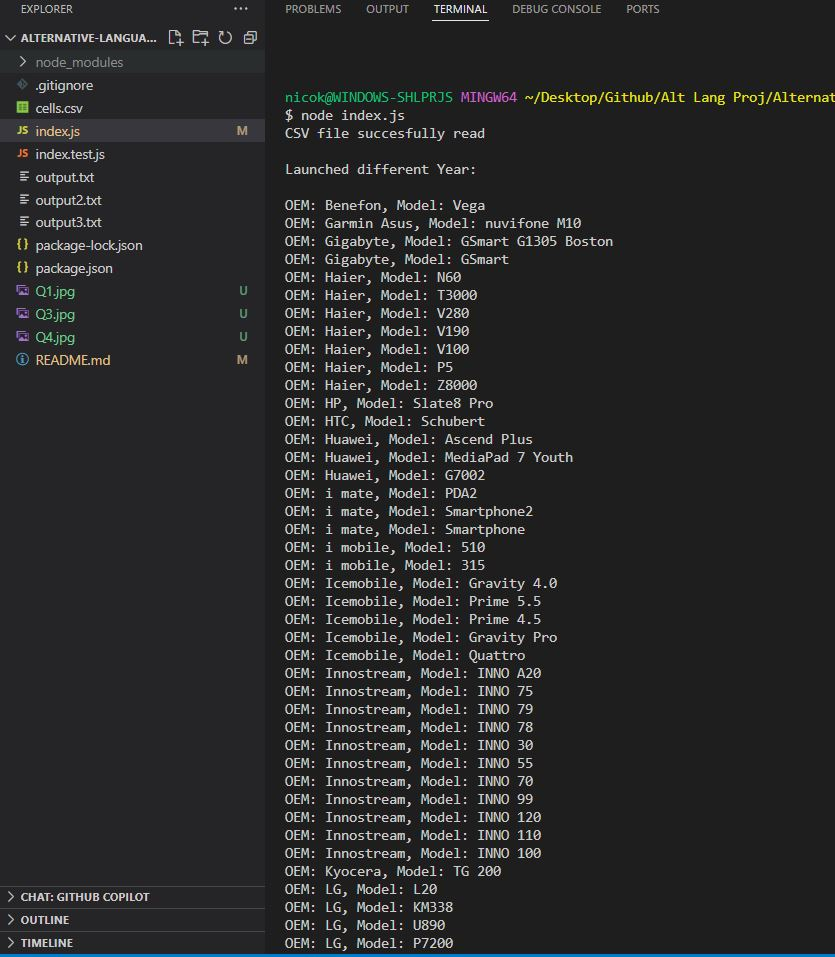
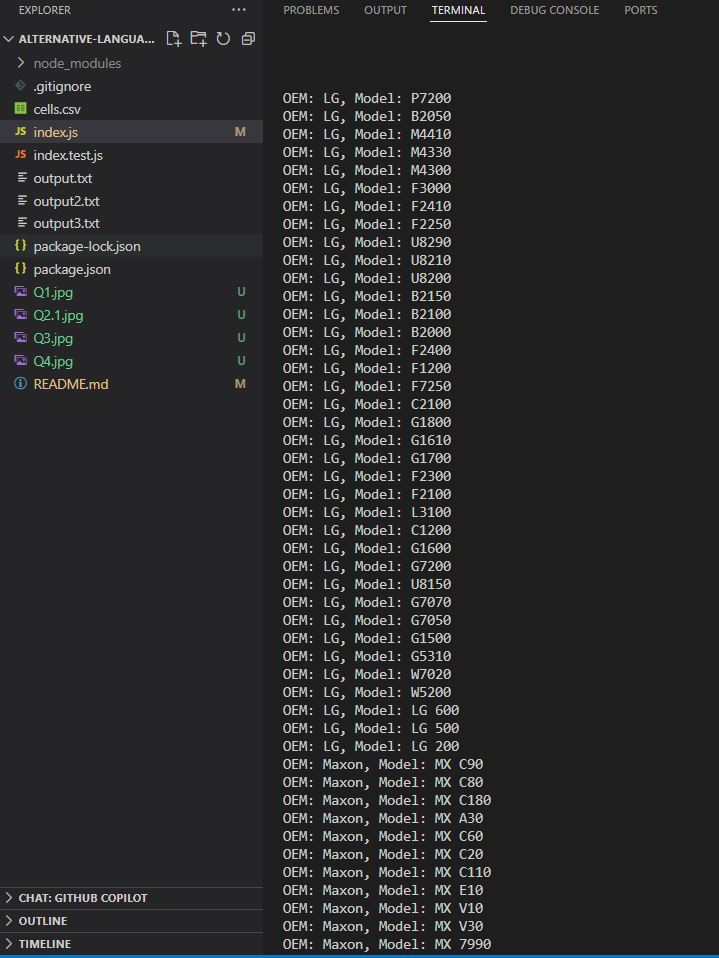
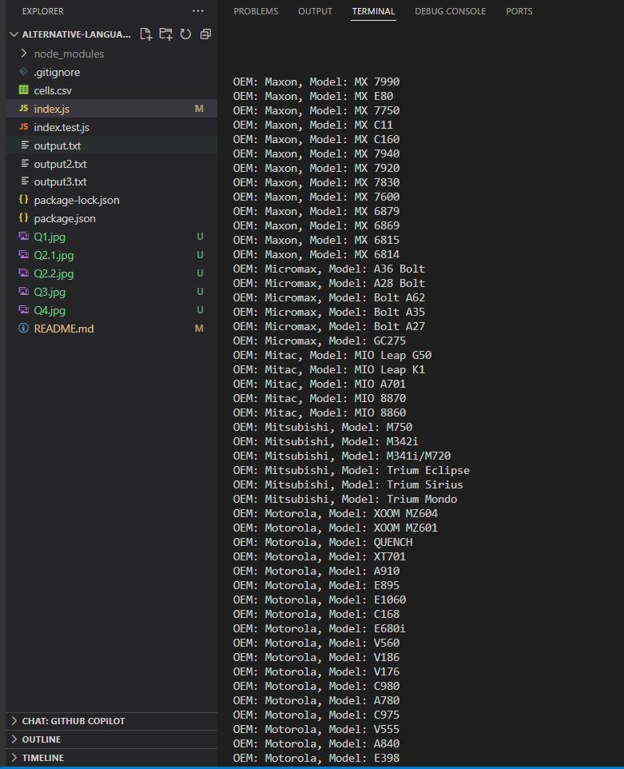
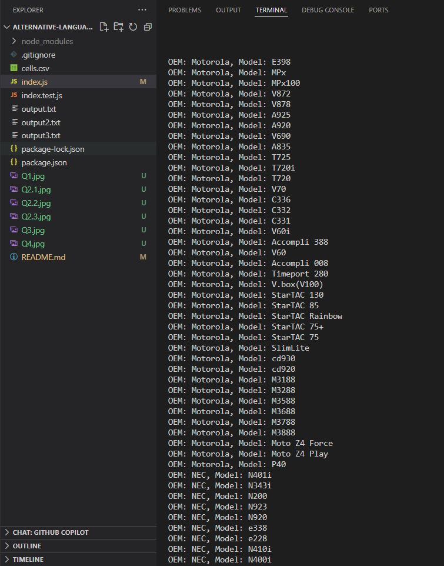
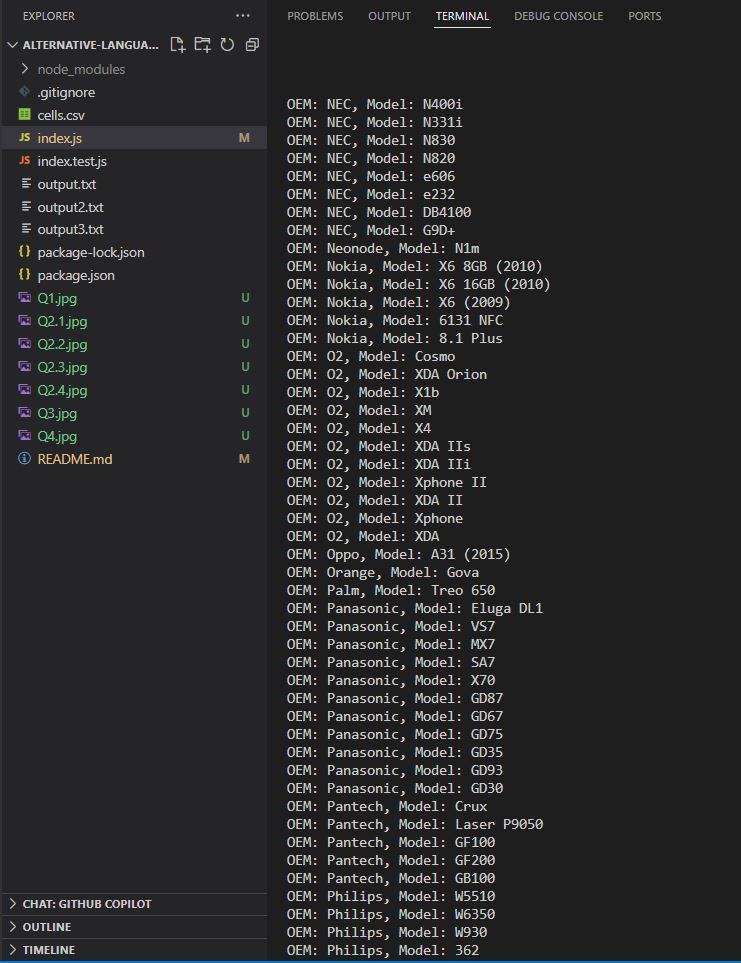
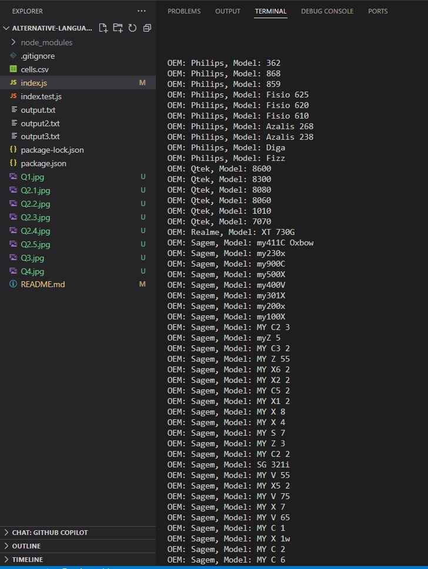
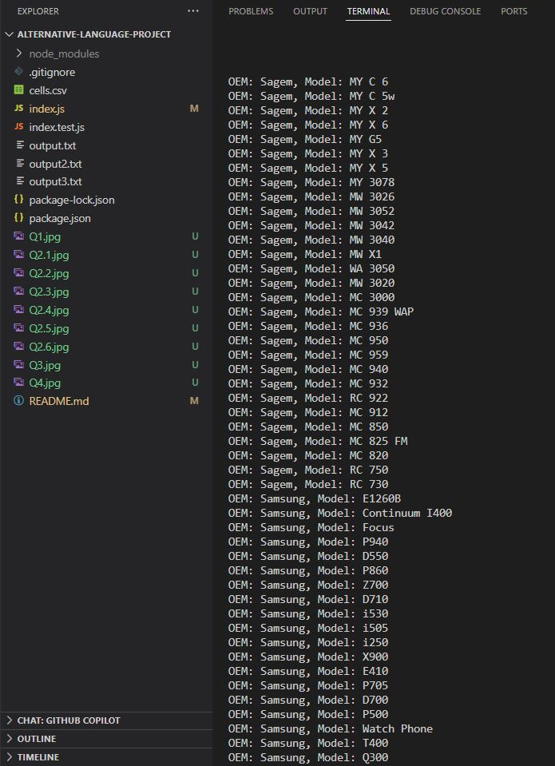
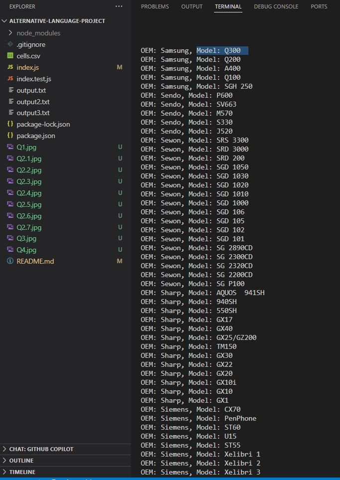
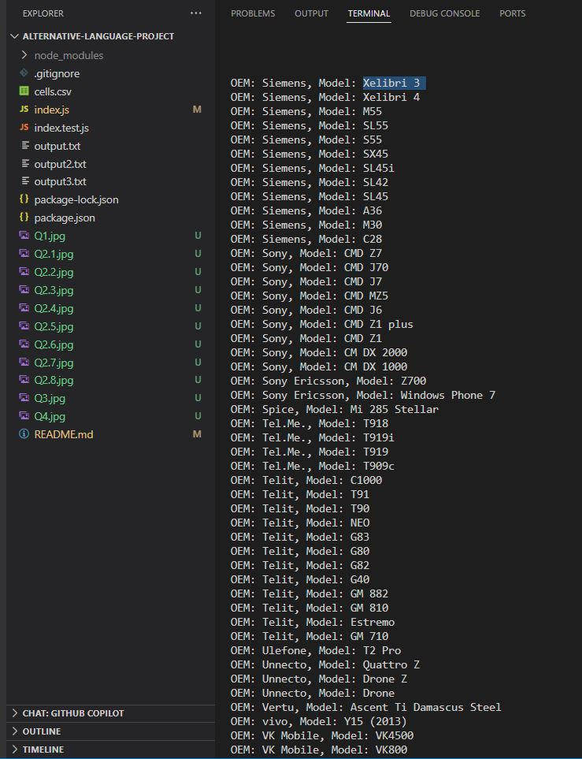
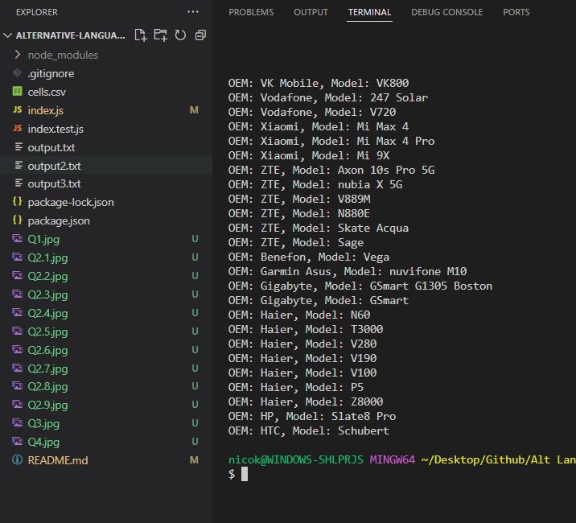

### Q3
How many phones have only one feature sensor?:

**Number of phones with 1 Feature Sensor: 432**

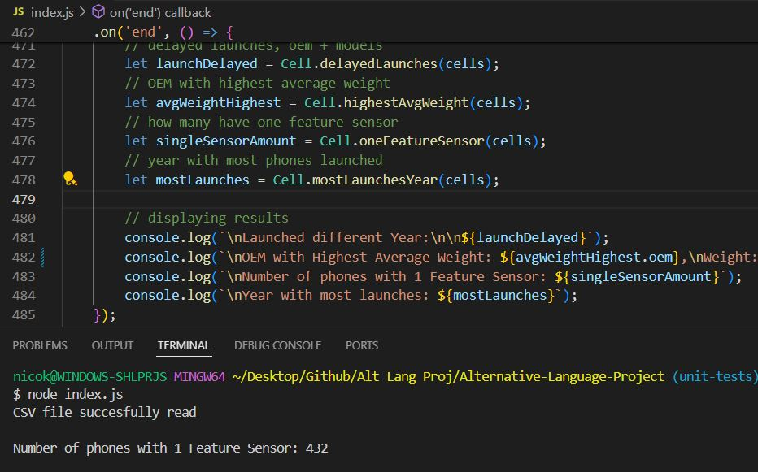

### Q4
What year had the most phones launched in any year later than 1999?:

**Year with most launches: 2019**

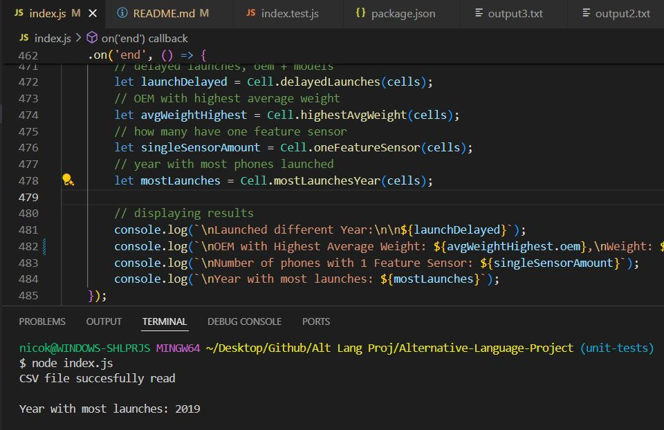